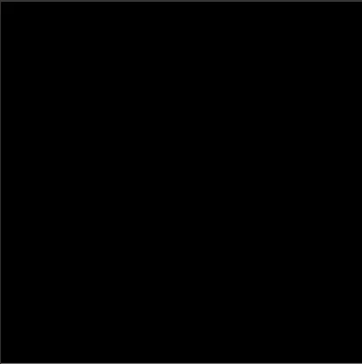
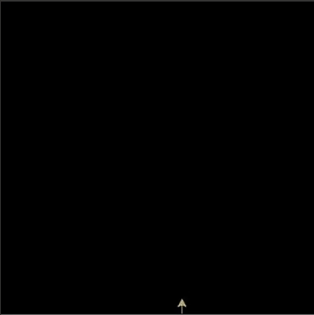

# L-Systems

A Python implementation of [Aristid Lindenmayer](https://en.wikipedia.org/wiki/Aristid_Lindenmayer) systems (L-Systems) 
for purely pedagogical purposes. 

L-Systems uses Python's [turtle graphics](https://docs.python.org/3/library/turtle.html) 
for rendering the L-Systems.

          |  
:-------------------------:|:-------------------------:
  |  

## What is an L-System?

_Taken from the [wikipedia](https://en.wikipedia.org/wiki/L-system) article_:

An L-system or Lindenmayer system is a parallel [rewriting system](https://en.wikipedia.org/wiki/Rewriting) and a 
type of [formal grammar](https://en.wikipedia.org/wiki/Formal_grammar). 

An L-system consists of an **alphabet** of symbols that can be used to make strings, a collection of **production** rules that 
expand each symbol into some larger string of symbols, an initial "**axiom**" string from which to begin construction, and 
a mechanism for translating the generated strings into geometric structures. 

L-systems were introduced and developed in 1968 by Aristid Lindenmayer, a Hungarian theoretical biologist and botanist at the University of Utrecht.
Lindenmayer used L-systems to describe the behaviour of plant cells and to model the growth processes of plant 
development. L-systems have also been used to model the morphology of a variety of organisms and can be used to 
generate self-similar fractals.

## Prerequisites

- Python 3.12
- [Poetry](https://python-poetry.org/)

On macOS I have to additionally install [python-tk](https://formulae.brew.sh/formula/python-tk@3.12):
```shell
brew install python-tk
```

## Installation
To install `L-Sytems` run:
```shell
poetry install
```

## Run the Tests
To execute all the unit-tests run:
```shell
poetry run pytest tests
```

## Build the Documentation
To build and view the project's documentation:
```shell
 poetry run mkdocs serve
```

## Run the Examples
Example implementations of L-Systems can be found under the `examples/` directory. 

All examples have been taken from the book by Przemyslaw Prusinkiewicz, Aristid Lindenmayer –
    [The Algorithmic Beauty of Plants](https://en.wikipedia.org/wiki/The_Algorithmic_Beauty_of_Plants).
```shell
poetry run python examples/bracketed_ol_system_fig1_24f.py
```

## Licence 
The content of this site is distributed under [MIT NON-AI License](License.md).

