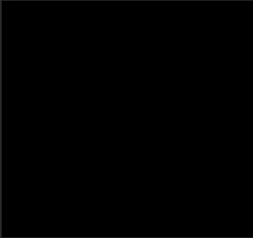

# How-to Use

To implement an L-System a user must inherit from the `Lsystem` abstract base class and provide:

- an `axiom` which is the initial string (state) of the L-System.
- A dictionary of productions (rules) which act on the state of the L-System and replace symbols (characters).
- number of `recursions`, how many times to apply the productions on the L-System state.

An example can be seen below:

```python
class DragonCurve(Lsystem):
    """Figure 1.7b Examples of Koch curves generated using L-systems: (b) A quadratic modification of the snowflake
    curve [95]"""

    axiom = 'A'
    productions = {'A': 'A+B+', 'B': '-A-B'}
    recursions = 10

```

Then the `LSystemRenderer` class can be used to render/animate an L-System along with some turtle graphics configuration:

```python
if __name__ == '__main__':
    lsystem = DragonCurve()
    turtle_conf = TurtleConfiguration(
        angle=90, # Rotation in degrees of the turtle.
        turtle_move_mapper={'A': 'F', 'B': 'F'},  # a dictionary that maps L-System symbols to turtle moves.
        initial_heading_angle=90 # Initial direction of the turtle.
    )
    global_settings = GlobalSettings(animate=True)
    renderer = LSystemRenderer(global_settings, lsystem, turtle_conf)
    renderer.draw()
```

Which yields the following animation:

  

More examples can be found in the `src/examples/` directory. 
Eg 
```shell
$ poetry run python src/l_system
```